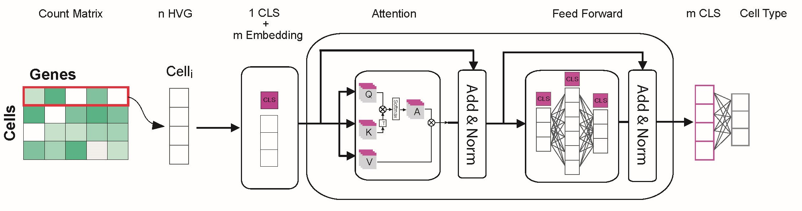

# scTransID v0.1.0

**scTRaCT** is a Python package designed for single-cell RNA sequencing data classification using a custom Transformer model. The package provides functions for data preprocessing, model training, and evaluation to streamline the process of analyzing cell type classification.




## Installation

To install the latest version directly from GitHub, use the following command:

```
pip install git+https://github.com/msmalmir/scTransID.git
```

## Data Input
**scTransID** will require you to give two directory where you saved the refrence and quety datasets. Both of them should be adata files and please be sure the refrence data includes 'celltype' information for each cell. 

## Output 
Output will be the predicted celltypes for the samples in query dataset. 

## Requirements

- Python 3.7+
- PyTorch
- scikit-learn
- scanpy

Install these dependencies via `pip`:

```
pip install torch scikit-learn scanpy
```

## Tutorial
For a complete usage example pleae refer to **Tutorial** folder in this GitHub repository, you can directly access it from [here.](https://github.com/msmalmir/scTransID/tree/main/Tutorial)
